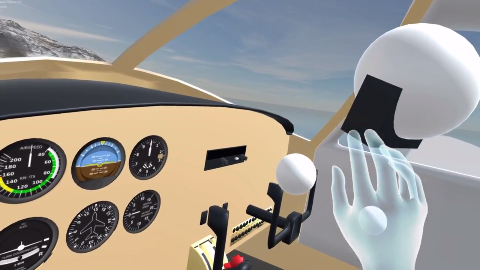

# VR Flight Simulator with Copilot

This is an extension to an existing project [VR Flight Simulator](https://github.com/BigBallerBrand/flightSimulator.git)

Video Demo for this project:

## Requirement
1. X-Plane 10 Software
2. At least one Oculus Rift with a pair of touch controllers (for main pilot).
3. (Optional) Another Oculus Rift with a pair of touch controllers.

## Getting Started

### 1. Configure X-Plane 10

Please refer to the previous project README page.

### 2. Run X-Plane 10

You can run it with any airport and make sure you are using **Cessna 172**.

### 3. Run "Mainpilot" in the "Builds" folder.

### 4. (Optional) Run "Copilot" in the "Builds" folder.

Note that the copilot **cannot** control the plane when the main pilot is controlling it.

## Built With
* NewtonVR
* OVR Avatar
* Photon Networking